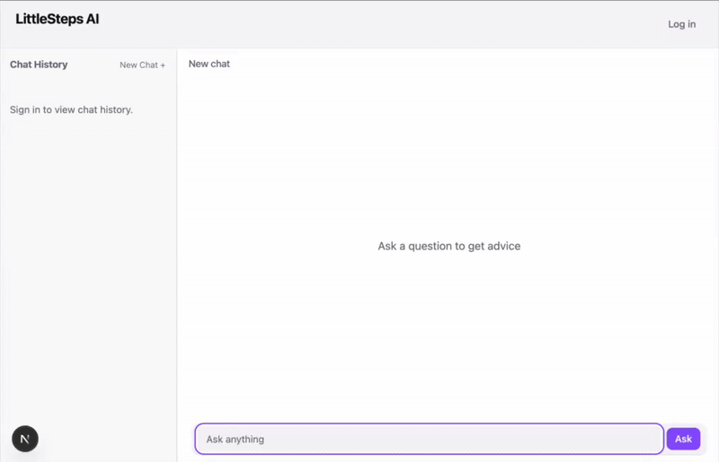

# littlesteps-ai [draft]

[](https://github.com/dileeparanawake/littlesteps-ai)

AI guidance for new parents - a full-stack, auth-gated LLM chat, built with **Next.js 15**, **PostgreSQL/Drizzle**, **React Query**, **Vitest**, **Docker**, **OpenAI**. Shipped in tagged minimum viable slices (MVS). [What’s an MVS? (Blog)](https://dileeparanawake.com/minimum-viable-slice).

**Keywords:** Next.js, React, TypeScript, PostgreSQL, Drizzle ORM, Docker, React Query, Zod, BetterAuth.js, Google OAuth, OpenAI API, Vitest, Full-stack development, API design, Authentication, Authorization, Database design, Testing, Containerisation, REST APIs

---

- 🗂️ [Project Kanban](https://github.com/users/dileeparanawake/projects/4/views/1)
- 🏷️ Release tags: [MVS1](https://github.com/dileeparanawake/littlesteps-ai/releases/tag/mvs1-complete) · [MVS2](https://github.com/dileeparanawake/littlesteps-ai/releases/tag/mvs2-complete) · [MVS3](https://github.com/dileeparanawake/littlesteps-ai/releases/tag/mvs3-complete)
- 🔍 [Diff since MVS2](https://github.com/dileeparanawake/littlesteps-ai/compare/mvs2-complete...HEAD)

## Demo



### Skills demonstrated

- Built a full-stack, auth-gated chat app using **Next.js**, **React**, **TypeScript**, and **React Query**.
- Modelled and persisted data in **PostgreSQL** with **Drizzle ORM** and **SQL migrations**, containerised via **Docker Compose**.
- Implemented **Google OAuth 2.0** authentication using **BetterAuth** with session-protected endpoints.
- Validated and sanitised inputs using **Zod**; followed RESTful API conventions for predictable error handling.
- Integrated **OpenAI’s API** for prompt–response handling on the server.
- Wrote **DB-backed tests** with **Vitest + Docker Postgres** to verify core actions and data integrity.

## Features by Minimum Viable Slice

Each slice represents a tagged, working release — from basic prompt handling to full auth-gated history.

<details>
<summary><b>MVS3 — Prompt History & Persistence</b></summary>

**Goal:** Persist chat threads and messages so logged-in users can revisit their prompt history.

**Key features**

- PostgreSQL + Drizzle schema for `thread` / `message` (UUIDs, ordered `sequence`).
- Auth-gated APIs (`/api/chat`, `/api/threads`) enforcing ownership.
- Rename & delete threads (≤60 chars, Zod validation, cascade delete).
- React Query caching / invalidation keeps sidebar and thread lists synced.
- DB-backed tests (Vitest + Docker Postgres) verify CRUD and ordering.

</details>

<details>
<summary><b>MVS2 — User Authentication (Google OAuth)</b></summary>

**Goal:** Secure app access with Google OAuth via BetterAuth.js.

**Key features**

- Google sign-in modal using BetterAuth.js (HttpOnly sessions).
- Auth-gated routes and session-aware UI state.
- Early DB prototype used SQLite (migrated to Postgres in MVS3).

</details>

<details>
<summary><b>MVS1 — Prompt Interface (No Auth)</b></summary>

**Goal:** Provide a simple OpenAI-powered prompt/response interface.

**Key features**

- Basic chat UI with secure API route to OpenAI.
- Docker Compose setup for containerised local development.
- Established initial minimum viable slice and project structure.

</details>

## Tech Stack

- **UI / App:** Next.js (App Router), React, TypeScript
- **Data layer:** React Query (@tanstack/react-query)
- **Database / ORM:** PostgreSQL (Docker) + Drizzle ORM (migrations)
- **Auth:** BetterAuth.js (Google OAuth, HttpOnly sessions)
- **Validation:** Zod
- **LLM:** OpenAI API (SDK)
- **Testing:** Vitest (DB-backed tests)
- **Dev / Infra:** Node 20 (Volta), Docker & Docker Compose

> Note: SQLite was used in MVS2 only; MVS3 migrated to PostgreSQL.

## Data Model

A small, explicit schema that prioritises **ownership**, **deterministic ordering**, and **clean deletes**.

<details>
<summary><b>Data model (expand)</b></summary>

```txt
User (id TEXT PK, email UNIQUE, name, createdAt, updatedAt)
 ├─ Session (id TEXT PK, token UNIQUE, expiresAt, userId FK → User.id ON DELETE CASCADE)
 ├─ Account (id TEXT PK, accountId, providerId, userId FK → User.id ON DELETE CASCADE)
 └─ Thread (id UUID PK, userId FK → User.id ON DELETE CASCADE, title VARCHAR(60), createdAt, updatedAt)
     └─ Message (id UUID PK, threadId FK → Thread.id ON DELETE CASCADE,
                 sequence INT, role ENUM[system|user|assistant], content TEXT,
                 createdAt, promptTokens?, completionTokens?, totalTokens?,
                 UNIQUE(threadId, sequence))
```

</details>

### Key decisions (what & why)

- **UUIDs for Thread/Message** → non-guessable, safe in URLs, simpler client routing.
- **Deterministic ordering** → `UNIQUE(thread_id, sequence)` ensures stable message order without relying on timestamps.
- **Ownership enforcement** → `thread.user_id` FK + API session checks (BetterAuth) guarantee users can only access their own threads.
- **Clean deletes** → `ON DELETE CASCADE` on FKs automatically removes dependent messages.
- **Tight title constraint** → `VARCHAR(60)` prevents UI overflow and keeps naming consistent.
- **Role enum** (`system | user | assistant`) → validates message type at the DB layer.
- **Token fields** (`promptTokens`, `completionTokens`, `totalTokens`) → reserved for future analytics and rate-limiting.

### Migration & testing workflow

- Schema changes are managed with **Drizzle migrations**.
- Tests are **DB-backed** (Vitest + Docker Postgres): create thread → append messages → fetch ordered → assert content & order.

## API quick reference

<details>
<summary><b>API reference (expand)</b></summary>

Authentication required for all endpoints (BetterAuth session).

POST /api/chat?threadId=UUID (optional)

- body: { "prompt": string }
- 200: { "threadID": UUID }
- 400 invalid body | 401 unauthenticated | 500 error
- Behavior: appends user prompt, calls OpenAI, appends assistant reply; creates a thread if none provided.

GET /api/chat?threadId=UUID

- 200: Message[] ordered by sequence
- 400 missing threadId | 401 unauthenticated | 403 not owner

GET /api/threads

- 200: Thread[] for the session user

PATCH /api/threads

- body: { "threadId": UUID, "title": string<=60 }
- 200: Thread | 400 invalid | 401 unauth | 403 forbidden

DELETE /api/threads

- body: { "threadId": UUID }
- 200: { "success": true } | 401 unauth | 403 forbidden | 404 not found

</details>

## Project structure

<details>
<summary><b>Project structure (expand)</b></summary>

```
┌─ src/app/ (Next.js App Router)
│  ├─ page.tsx (landing)
│  ├─ chat/[threadId]/page.tsx (thread view)
│  └─ api/
│     ├─ auth/[...all]/route.ts (BetterAuth handlers)
│     ├─ chat/route.ts (POST: send msg, GET: fetch msgs)
│     └─ threads/route.ts (GET: list, PATCH: rename, DELETE)
│
├─ src/components/
│  ├─ chat/
│  │  ├─ ChatSidebar/ (thread list, rename, delete)
│  │  └─ ChatThread/ (message list, input, submit)
│  ├─ sign-in/ (Google OAuth modal)
│  └─ layout/Header.tsx (nav, session UI)
│
└─ src/lib/
   ├─ auth.ts (BetterAuth config)
   ├─ chat/ (DB operations: create, read, update, delete)
   └─ db/ (Drizzle schema, migrations)
```

**Data flow:** User → React components → API routes → Drizzle ORM → PostgreSQL

</details>

## Architecture at a glance

- **App:** Next.js App Router; server routes for APIs, client components for UI.
- **Auth/Data:** BetterAuth.js + Drizzle ORM → Postgres (UUID, sequence ordering).
- **Client state:** React Query cache; invalidation on rename/delete/post.

## Tests

```bash
pnpm test
```

DB-backed (Vitest + Docker Postgres): create/read/update/delete flows for threads/messages.

## Local Development

See full guide: [`public/docs/local-dev-guide.md`](./public/docs/local-dev-guide.md)

Quick start:

```bash
docker compose up -d
pnpm migrate
```

## Releases

- 2025-10-21 — MVS3: Prompt history & persistence — [Tag](https://github.com/dileeparanawake/littlesteps-ai/releases/tag/mvs3-complete)
- 2025-07-27 — MVS2: User Authentication — [Tag](https://github.com/dileeparanawake/littlesteps-ai/releases/tag/mvs2-complete)
- 2025-07-20 — MVS1: Prompt Interface — [Tag](https://github.com/dileeparanawake/littlesteps-ai/releases/tag/mvs1-complete)

## License

This project is licensed under the [MIT License](./LICENSE).
