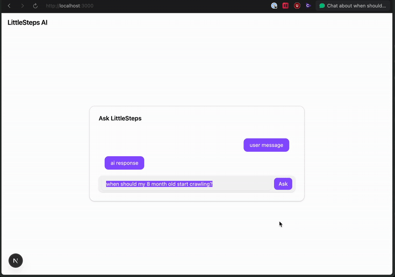

# littlesteps-ai

Full-stack AI milestone tracker for parents — built with Next.js, Docker, and OpenAI.

A secure, containerized LLM interface for developmental guidance. Each feature is delivered as a vertical slice (MVS) [read MVS blog post](https://dileeparanawake.com/minimum-viable-slice) to showcase real-world planning, devops, and full-stack skills.

[Project Kanban](https://github.com/users/dileeparanawake/projects/4/views/1)

## Screenshot: MVS 2 Complete: Next.js Prompt Interface + Docker Compose Setup, Google OAuth.



Simple frontend + backend OpenAI integration, containerized for local development, using Google OAuth via BetterAuth.js. Using SQLite DB for persistance.

## 🎯 Milestone: MVS 1 — Prompt Interface (No Auth)

🔗 [View source at MVS1 tag](https://github.com/dileeparanawake/littlesteps-ai/releases/tag/mvs1-complete) – snapshot of the code at milestone completion

**Goal:** A basic prompt/response interface using OpenAI, containerized for local dev.

### ✅ Features

- Next.js frontend with text input + response output
- Backend API route (`/api/prompt`) to call OpenAI securely
- Docker + Docker Compose for local development
- `.env` config with secure key handling

### ❌ Not Included (Out of Scope)

- Auth or user accounts
- Prompt history or streaming
- Conversational context or personalization

## 🎯 Milestone: MVS 2 — User Authentication (Google OAuth)

🔗 [View source at MVS2 tag](https://github.com/dileeparanawake/littlesteps-ai/releases/tag/mvs2-complete) – snapshot of the code at milestone completion

**Goal:** Secure the application using Google OAuth login via BetterAuth.js. Gated prompt access behind authenticated sessions with session-aware frontend and modal-based sign-in UX.

### ✅ Features

- Google login via BetterAuth.js
- Session stored in secure HttpOnly cookie
- Conditional UI based on authentication state
- Modal-based sign-in prompt
- Auth-gated API route (`/api/prompt`)

### ❌ Not Included (Out of Scope)

- Saving prompt history
- Admin roles or dashboards
- Role-based access control

## 🐳 Local Development with Docker (suggested)

You can run the full-stack app (Next.js frontend + API) using Docker and Docker Compose.

### 🔧 Prerequisites

- [Docker](https://docs.docker.com/get-docker/) and [Docker Compose](https://docs.docker.com/compose/install/) installed
- `.env` file with your `OPENAI_API_KEY` at the project root (see `.env.example`)

### 🚀 Run the app in Docker

```bash
docker-compose down --volumes --remove-orphans
docker-compose build --no-cache
docker-compose up
```

- The app will be available at [http://localhost:3000](http://localhost:3000)
- Hot reloading is enabled (via bind-mounted volume)

### 🛑 Stop the app

```bash
docker-compose down
```

### 📁 Notes

- `/app/node_modules` is isolated from the host to prevent dependency conflicts
- Build artifacts like `.next/` will appear locally (just like running `pnpm dev` outside Docker)

### 📄 Example `.env` file

```env
# .env.example
OPENAI_API_KEY=your-openai-api-key-here
OPENAI_API_MOCK_KEY=sk-0
MOCK_API=false
```

## ⚙️ Local Development (without Docker using Next.js)

### Running locally without Docker

First, run the development server:

**Note** you may see “ignored build scripts” on first install. Run pnpm approve-builds if needed.

```bash
pnpm dev
```

Open [http://localhost:3000](http://localhost:3000) with your browser to see the result.

## 🔧 Tech Stack

- **Next.js** – Full-stack React framework (frontend + backend API routes)
- **TypeScript** – Type-safe JavaScript development
- **pnpm** – Fast and efficient package manager
- **OpenAI API** – LLM-powered prompt/response generation
- **Docker** – Containerized dev environment
- **Docker Compose** – Local orchestration (frontend + API, with volumes)
- **BetterAuth.js** – Authentication with Google OAuth and session cookies
- **SQLite** – Temporary database for local authentication
- **better-sqlite3** – Fast SQLite driver used by BetterAuth
- **Tailwind CSS** – Utility-first styling
- **shadcn/ui** – Accessible prebuilt React UI components
- **.env config** – Secure handling of API keys and environment toggles

## 🐞 Known Issues

See [known-issues.md](./known-issues.md) for notes on disabled features, bugs, and future fixes.

## 🛠️ Skills Demonstrated

- Full-stack development using **Next.js** with API Routes
- **Google OAuth** Authentication with BetterAuth.js
- Secure session handling with **HttpOnly cookies**
- Conditional rendering with **React hooks** to manage session state
- Frontend & backend coordination for session-aware UX
- Containerized development with **Docker Compose**
- Modal UI design with **accessibility** and **loading/error states**
- Use of **TypeScript** interfaces and state management patterns

## 📈 Changelog

### MVS 2 (2025-07-27)

- Added Google OAuth login with BetterAuth.js
- Gated `/api/prompt` route behind session
- Created modal-based sign-in flow
- Persisted prompt input across OAuth redirects

### MVS 1 (2025-07-20)

- Created prompt input UI with OpenAI backend integration
- Docker Compose setup for containerized local development

## 🔪 Planned MVS Slices

Each slice represents a testable, deployable vertical feature. Completed items are ticked as we go.

- [x] **MVS 1: Prompt Interface** – Basic frontend + backend OpenAI prompt-response with Docker Compose.
- [x] **MVS 2: User Authentication** – Google OAuth login and gated access to prompt interface.
- [ ] **MVS 3: Prompt History & Persistence** – PostgreSQL + Drizzle ORM to store user prompts & responses.
- [ ] **MVS 3a: Rate Limiting** – Prevent excessive requests to OpenAI and login endpoints.
- [ ] **MVS 4: Hosting & Deployment** – Deploy via Docker to DigitalOcean with secure config and optional CI/CD.
- [ ] **MVS 5: Milestone Guidance** – Use LLM to suggest parenting milestones based on prompt history.

## 📝 License

This project is licensed under the [MIT License](./LICENSE).
