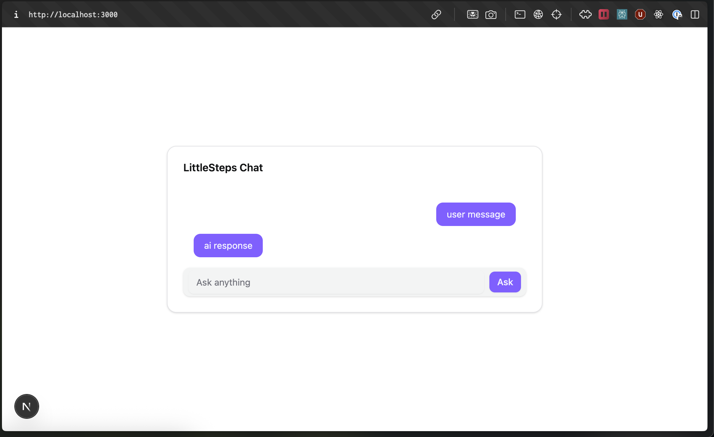

# littlesteps-ai

Full-stack LLM app with auth, prompt history, and Docker — for personalised parenting support

[Project Kanban](https://github.com/users/dileeparanawake/projects/4/views/1)

Screenshot - Skeleton UI


## 📝 License

This project is licensed under the [MIT License](./LICENSE).

## Next setup

This is a [Next.js](https://nextjs.org) project bootstrapped with [`create-next-app`](https://nextjs.org/docs/app/api-reference/cli/create-next-app).

### Getting Started

First, run the development server:

```bash
npm run dev
# or
yarn dev
# or
pnpm dev #  If using pnpm, you may see “ignored build scripts” on first install. Run pnpm approve-builds if needed.
# or
bun dev
```

Open [http://localhost:3000](http://localhost:3000) with your browser to see the result.

You can start editing the page by modifying `app/page.tsx`. The page auto-updates as you edit the file.

This project uses [`next/font`](https://nextjs.org/docs/app/building-your-application/optimizing/fonts) to automatically optimize and load [Geist](https://vercel.com/font), a new font family for Vercel.
